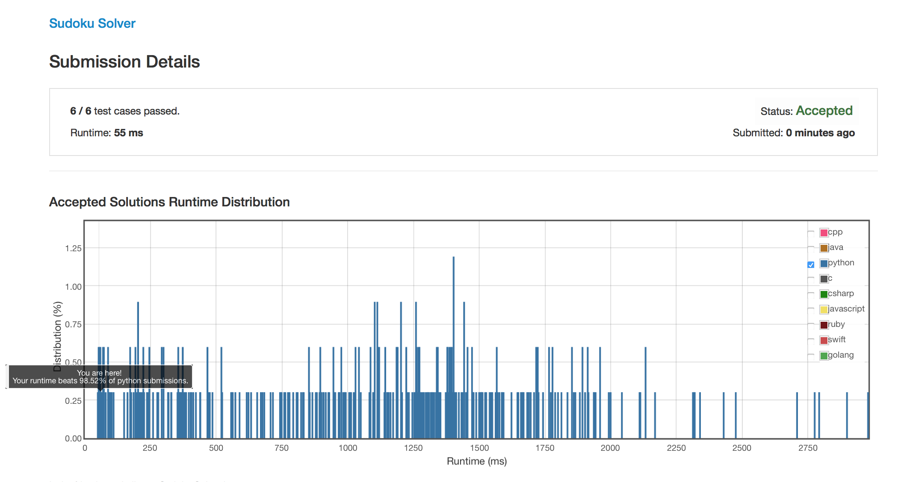

# SudokuSolver LeetCode 37

This is a solution of [LeetCode 37 Sudoku Solver](https://leetcode.com/problems/sudoku-solver/).

> Write a program to solve a Sudoku puzzle by filling the empty cells.

> Empty cells are indicated by the character `'.'`.

> You may assume that there will be only one unique solution.

> A sudoku puzzle...


>  ...and its solution numbers marked in red.

The solution use bit encoded to represent the num 1~9 and use a lot of bitwise operation. The solution runtime is 55ms which beats 98.52% of all submission.



## example

```python
import sudoku
board=["..9748...","7........",".2.1.9...","..7...24.",".64.1.59.",".98...3..","...8.3.2.","........6","...2759.."]
s=sudoku.Solution()
s.solveSudoku(board)
print(s)
```

result:

```bash
[5|1|9|7|4|8|6|3|2]
[7|8|3|6|5|2|4|1|9]
[4|2|6|1|3|9|8|7|5]
[3|5|7|9|8|6|2|4|1]
[2|6|4|3|1|7|5|9|8]
[1|9|8|5|2|4|3|6|7]
[9|7|5|8|6|3|1|2|4]
[8|3|2|4|9|1|7|5|6]
[6|4|1|2|7|5|9|8|3]
```
